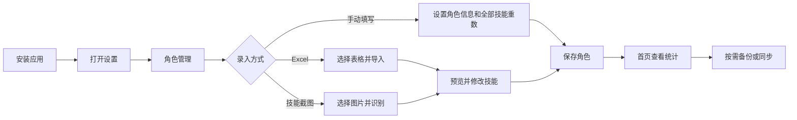
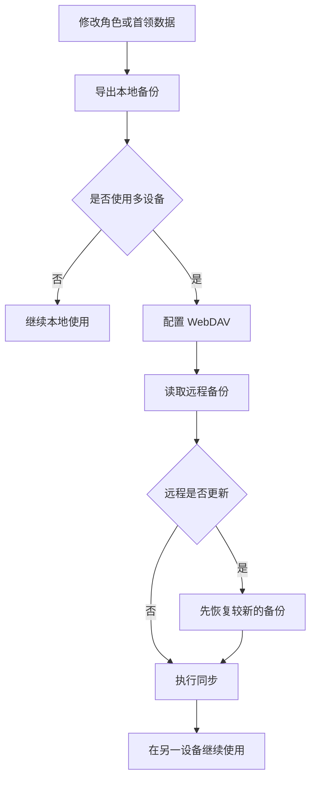

# 百战异闻录助手


一款面向《剑网 3》百战异闻录的桌面端技能管理工具。它可以按角色记录技能重数，自动统计精神值、耐力值和通本需求，并把重要技能、可交易技能和首领技能集中到一个界面中维护。

应用以本地数据为主，不依赖在线服务也可以正常使用；需要时可以通过本地文件、WebDAV 或首领技能数据更新完成备份和同步。

## 功能概览

| 功能 | 能做什么 |
| --- | --- |
| 角色管理 | 新增、编辑、删除、拖动排序角色；支持双击卡片或点击编辑图标进入编辑。 |
| 角色导入 | 在新增或编辑角色时导入 Excel 表格，或导入技能截图；导入后可以预览并逐项修改。 |
| 技能记录 | 记录每个角色的技能重数，支持设置“全部技能重数”，并在首页直接调整单个技能。 |
| 属性统计 | 根据当前技能重数自动计算精神值、耐力值和技能重数进度。 |
| 通本需求 | 按原始表格计算公式统计不同重数档位的通本需求。 |
| 技能筛选 | 查看所有技能、重要技能和可交易技能，并按首领、技能、重数等条件筛选。 |
| 首领管理 | 查看、排序、编辑首领和技能，支持全部导出、增量导入和检查数据更新。 |
| 同步备份 | 支持本地备份、WebDAV 备份和远程恢复，区分“最新版本”和“当前版本”。 |
| 本地数据迁移 | 可以修改本地数据保存位置；确认后应用会立即重启，并在新实例启动时完成迁移。 |
| 自动更新 | 启动时检查首领技能数据和应用版本，首领数据更新可以选择立即更新或跳过此版本。 |

## 推荐使用流程



## 安装与启动

前往 [Releases](https://github.com/cyan77/baizhan-skill/releases) 下载对应平台的安装包。

### Windows

- **安装版**：下载 `BaizhanSkill-Windows-x64-Setup.exe`，按安装向导完成安装。安装版支持安装目录、开始菜单、桌面快捷方式和卸载。
- **便携版**：下载 `BaizhanSkill-Windows-x64.zip`，解压整个文件夹后运行其中的应用程序。便携版适合不想安装到系统的场景。

### macOS

下载 `BaizhanSkill-macOS-Setup.pkg`，双击后按安装器提示完成安装。macOS 发布使用 PKG 安装流程，不需要手动复制 DMG 中的应用。

## 第一次使用：新增角色

1. 打开应用，进入“设置 → 角色管理”。
2. 点击“添加角色”。
3. 填写角色名称、性别、门派、心法、定位和换将点。
4. 在“全部技能重数”中设置初始重数，或使用下方的导入功能。
5. 点击“预览技能与属性”，确认技能重数、精神值和耐力值。
6. 点击“保存”。

角色保存后，首页会显示该角色的门派、心法、定位、换将点、技能重数进度、精神和耐力。

> 编辑已有角色时，“全部技能重数”会默认取当前已录入技能的最低有效重数。例如已有技能同时出现 10 重和 9 重，默认值会显示为 9 重，避免覆盖较低重数的记录。

## 角色导入与技能预览

新增和编辑角色都支持以下操作：

### Excel 表格导入

1. 在角色编辑窗口点击“导入 Excel”。
2. 选择技能表格文件。
3. 导入完成后打开“角色技能预览”。
4. 检查识别出的角色信息和技能重数，必要时直接修改。
5. 返回编辑窗口并保存角色。

如果表格中已经填写角色名称，会优先使用表格中的名称；只有角色名称为空时，才会使用 Sheet 名称作为角色名称。

### 图片导入

1. 在角色编辑窗口点击“导入图片”。
2. 选择技能截图。
3. 等待识别完成后进入技能预览。
4. 对识别结果进行检查和修正，再保存角色。

图片识别适用于 Windows 和 macOS。截图尽量保持清晰、完整，并避免把多个无关界面元素放进识别区域。

### 技能预览

预览窗口会同时显示：

- 精神值和耐力值预估；
- 按首领分组的技能重数；
- 可排序的攻略进度；
- 每项技能的当前重数。

首领较多或窗口较窄时，可以横向滚动查看完整内容。

## 角色管理

角色管理页面支持以下操作：

- 长按角色卡片并拖动，调整角色顺序；
- 双击角色卡片进入编辑；
- 点击右上角编辑图标进入编辑；
- 点击启用/禁用开关切换角色状态；
- 点击“添加角色”新增角色。

禁用角色不会被删除，但不会再出现在首页角色格、角色切换菜单和其他页面的筛选条件中。需要恢复时，在角色管理页面重新点击开关即可。

## 首页与技能统计

首页用于查看当前角色的整体状态：

- 角色卡片显示门派、心法、定位、换将点和技能重数进度；
- 进度条下方显示精神值和耐力值；
- 点击技能可以修改当前技能重数；
- “本周 CD”只表示完成状态，不会通过加深背景或边框影响当前选中角色的辨识；
- 顶部角色选择器只显示已启用角色。

侧边栏中的三个技能页面用途如下：

| 页面 | 用途 |
| --- | --- |
| 重要技能 | 集中查看需要优先提升或重点追踪的技能。 |
| 可交易技能 | 查看可交易技能及各角色的重数情况。 |
| 所有技能 | 按首领和技能的完整层级查看全部记录。 |

角色较多时，重要技能和可交易技能页面支持横向滚动，可以查看完整的角色矩阵。

## 通本需求与属性计算

应用会根据当前角色的技能重数自动计算精神值、耐力值和通本需求，不需要手动填写统计结果。

- 精神值和耐力值会随技能重数及首领属性提升自动计算；
- 通本需求使用原始表格中的计算公式；
- 首领顺序遵循首领数据中的管理顺序；
- “罗伊客”位于倒数第二项，“无精耐提升技能”位于最后一项；
- 角色技能重数修改后，相关统计会同步更新。

## 首领技能管理

进入“设置 → 首领技能管理”可以维护基础数据。

### 日常维护

1. 拖动首领左侧把手调整显示顺序。
2. 展开首领查看其技能。
3. 修改首领或技能的名称、属性和可交易状态。
4. 保存后，已有角色会继续保留原来的技能重数。

### 导入与导出

- **导出全部**：导出完整的首领和技能数据，适合备份或迁移。
- **增量导入**：只补充尚未添加的首领和技能，不覆盖已有记录。
- 修改 `data/baizhan-bosses.json` 后，需要递增 `version`，并填写 `updatedAt` 和 `notes`。

### 检查数据更新

应用检测到新的首领技能数据时，可以选择：

- **查看更新**：先查看版本号、更新时间和更新说明；
- **立即更新**：同步首领基础信息和技能列表，并保留角色现有技能重数；
- **跳过此版本**：不再自动提示这个版本；以后仍可通过“检查数据更新”主动检查。

## 同步与备份

进入“设置 → 同步与备份”。

### 本地备份

- 点击“导出本地备份”保存当前数据；
- 点击“导入本地备份”从备份文件恢复；
- 恢复前建议先导出一次当前数据，避免误覆盖。

### WebDAV 同步

在“WebDAV 云同步”中填写地址、账号、密码和远程路径，然后测试连接并读取远程备份。

远程备份列表会明确标记：

- **最新版本**：当前远程列表中最新的一份备份；
- **当前版本**：本设备当前使用的备份版本。

检测到较新的云端备份时，建议先点击“恢复”，确认数据无误后再继续同步，避免用旧数据覆盖新数据。

### 修改本地数据保存位置

1. 进入“设置 → 本地数据位置”。
2. 选择新的数据文件路径。
3. 确认“重启并迁移本地数据”。
4. 应用会立即重启。
5. 新实例启动后自动完成数据迁移；迁移成功后，后续数据会保存到新的位置。

如果应用显示“待重启”，重新打开应用即可触发迁移；迁移完成前不要删除旧的数据文件。

## 数据安全建议



推荐在批量导入、首领数据更新和修改本地保存位置前后各保留一份备份。

## 常见问题

### 删除便携版文件夹后，数据为什么还在？

应用数据默认保存在系统用户数据目录，不在便携版解压文件夹内。删除应用文件夹不会删除用户数据，这是为了避免更新应用时误删角色记录。可以在“本地数据位置”查看和修改实际保存路径。

### 为什么禁用角色后其他页面看不到了？

禁用状态会从首页、角色切换和筛选条件中排除该角色，但角色数据仍保留在“角色管理”中。重新启用即可恢复使用。

### 导入结果需要手动修正吗？

建议修正。Excel 和图片导入用于快速建立初始记录，保存前应在“角色技能预览”中核对技能名称、首领归属和重数。

## 开发与测试

项目基于 Flutter，开发环境需要 Flutter 3.x 及 Dart 3.3 或更高版本。

```bash
flutter pub get
flutter run -d macos
```

运行测试和静态检查：

```bash
flutter test --no-pub
flutter analyze
```

## 项目结构

```text
assets/                 图标和心法图片
data/                   首领与技能基础数据
lib/main.dart           应用界面、角色和统计逻辑
lib/character_excel_import.dart
                        Excel 角色导入
lib/boss_catalog_service.dart
                        首领数据版本检查与更新
lib/sync_service.dart   本地/WebDAV 备份同步
installer/              Windows 安装包配置
.github/workflows/      Windows、macOS 构建与 Release 发布流程
```

## 版本记录

- [更新日志](CHANGELOG.md)
- [全部 Releases](https://github.com/cyan77/baizhan-skill/releases)
- 当前版本：`v0.1.16`
